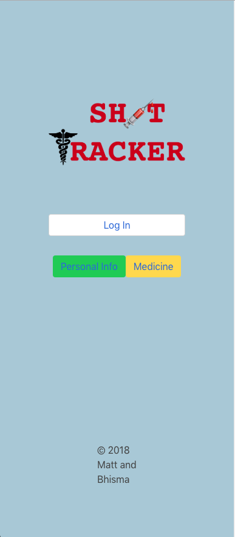
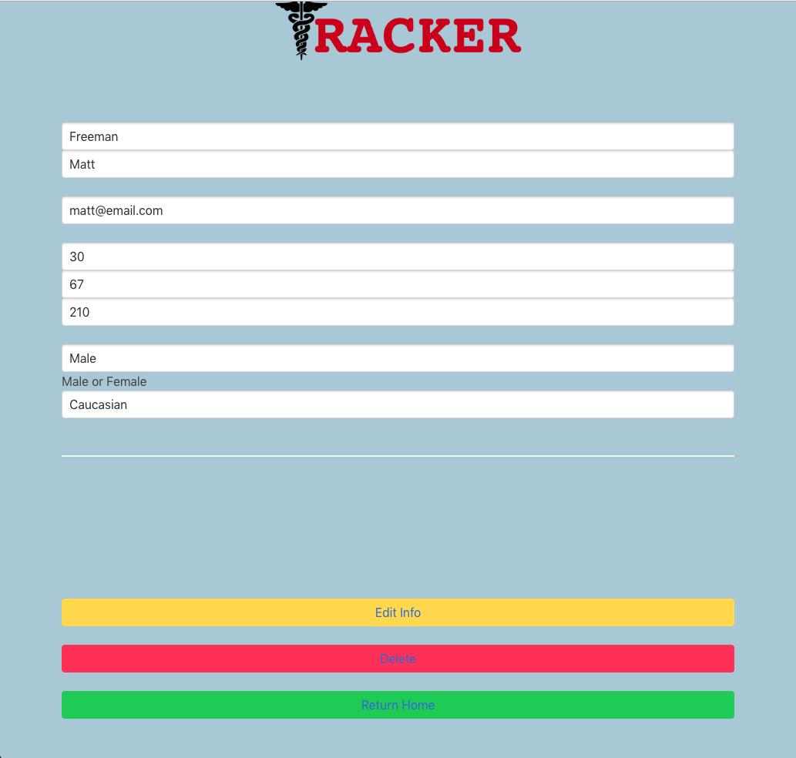
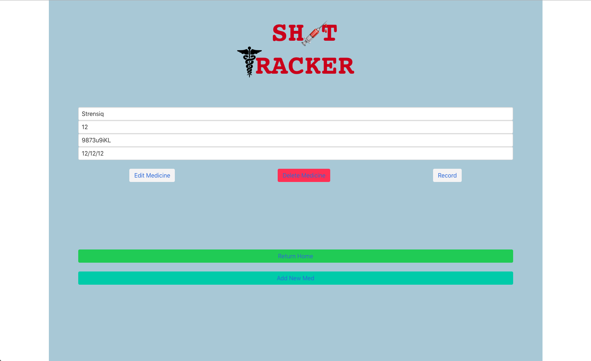
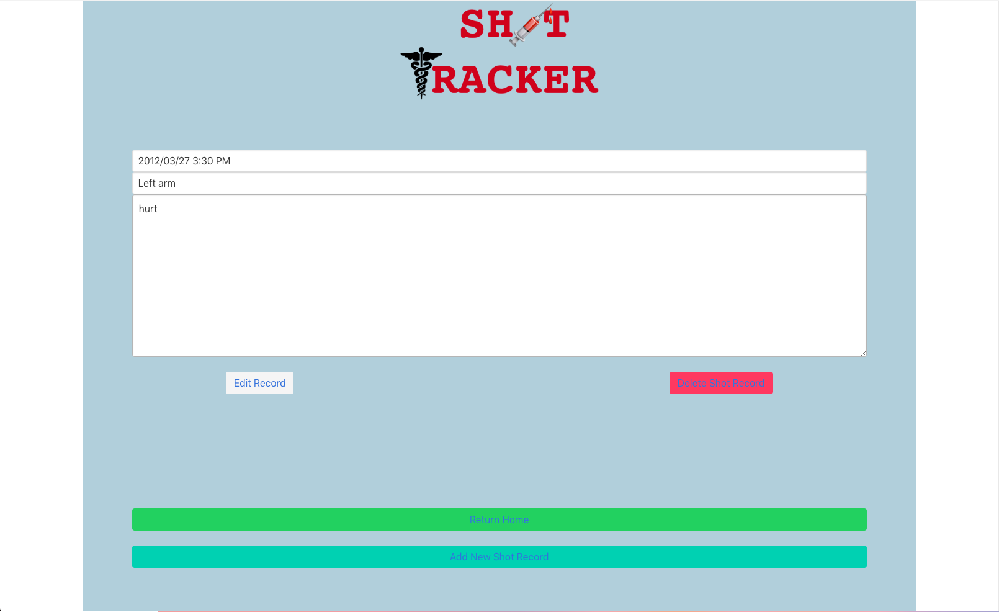

# Shot Tracker Application
DC Group Project #2 - July 3, 2018

## Authors

* **Matthew Freeman** - [matthewfreeman821](https://github.com/matthewfreeman821)
* **Bhisma Bakhai** - [Bhisma93](https://https://github.com/Bhisma93)

## Built With

* HTML5/CSS3
* JavaScript ES5
* Node.js
* Express.js
* Handlebars
* Postgres SQL
* Postico
* Bulma
* Sketch
* Trello

## Development Process
* [1. Concept](#1-concept)
* [2. Initial Planning](#2-initial-planning)
* [3. Obstacles and Breakthroughs!](#3-obstacles-and-breakthroughs)
* [4. Future Additions](#4-future-additions)

### 1. Concept

We decided to create an application that people who take daily medicine could use, specifically shot as it was inspired by situations in one of our own personal lives. The user is able to currently log in via Github and put in their personal information if they choose. Upon logging in the user is able to fill out forms for particular medicines that he/she takes. Along with the medicines the user is able to store a record of each individual time he or she has taken it. Although our current application is available on all platforms, it was intended to be more of a mobile application.

### 2. Initial Planning

Our planning mainly consisted of what would be necessary for the user while using our application which gave us three main parts to work on the user, the medicine, and the medicine records. We started with the user, upon logging in the user is prompted to put in information if they choose to that can be edited at any time. After the personal info section the user is allowed to enter the medicine side. This section is where the user can enter the Medicine they are taking and can detail information like the dosage and log number. They are able to store as many different shots/types of medication as they desire. Each medication has its own individual records section, this is where the user can log dates and notes about the particular day of medication and any reactions or allergies that may have occured as a result of the medication. As all things in our application the user is able to go back and edit the information.

### 3. Obstacles and Breakthroughs

Some of the major challenges we faced were getting our routes to work correctly, as well as hooking up passport to our express application. 

The largest hurdle we faced was making sure everything was routing correctly using handlebars while also using passport to ensure authorization. Some of the pages we wanted to render the users information to would not render at first, which we ended up solving. We also slightly had to look up documentation and learn how to use Bulma to style the conents of our page. Overall we didn't encounter as many obstacles as we thought we would have, through our team work if one of us didn't know the answer to a problem the other usually did, and if neither did we used Google. 

### 4. Future Additions

If we had more time, we would...

* A better layout for listing information and records.
* A login/logout feature not using github but storing user information on our server.
* A notification feature to let the user know when their medical supply is getting low.

## License 
Copyright 2018 Matt Freeman, Bhisma Bakhai
